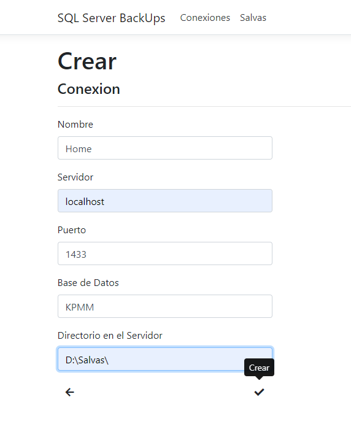
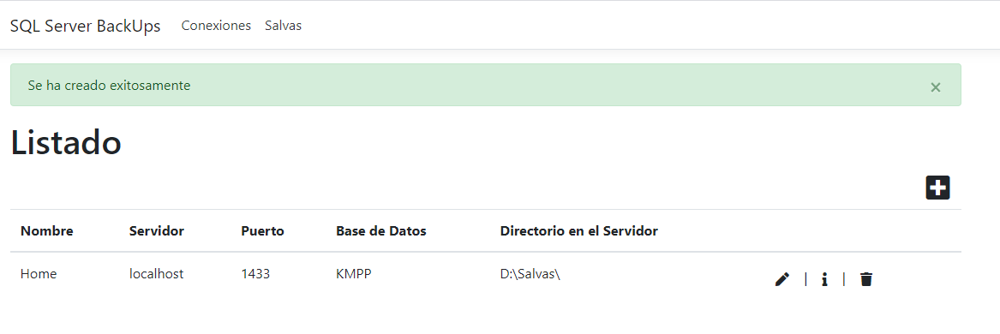
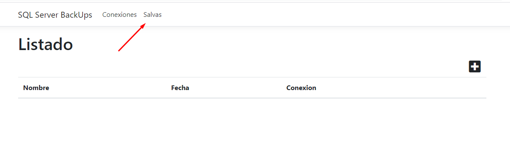
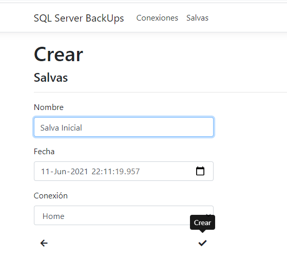
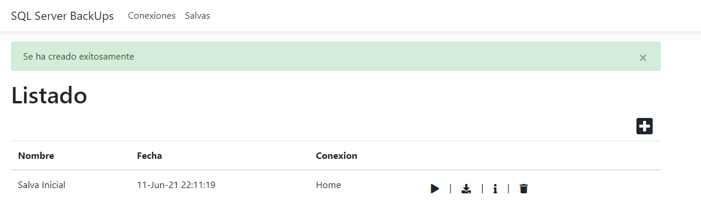
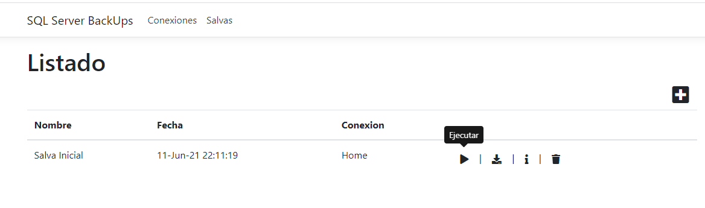
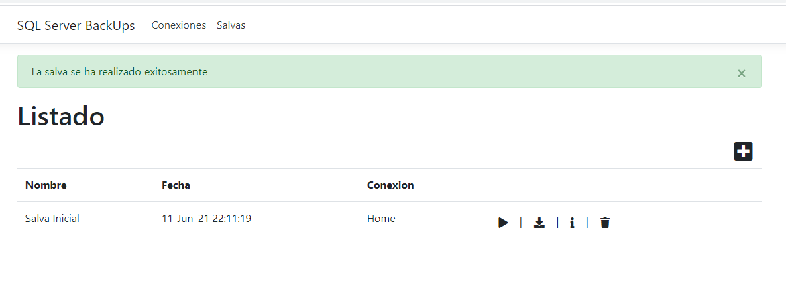
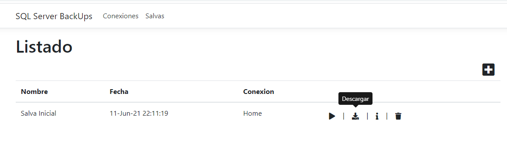
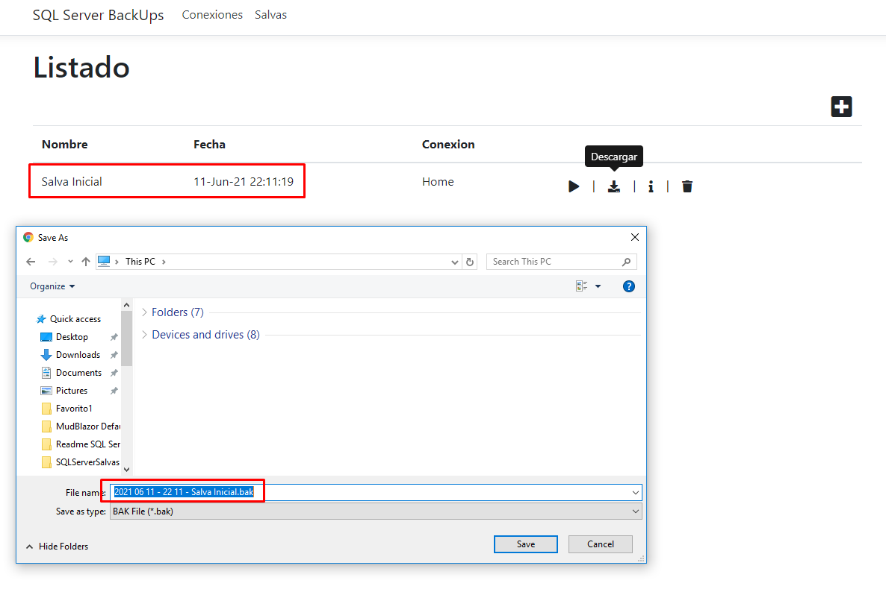

# SQL Server Salvas
Asp. Net Core proyect for creating SQL Server backups manually

1. Conexion setting list

2. Create conexion setting

3. Conexion setting created succesfully

4. Backup list

5. Creating backup properties

6. Backup properties created succesfully

7. Execute backup

8. Backup succesfully created

9. Download backup file

10. Saving backup file 

